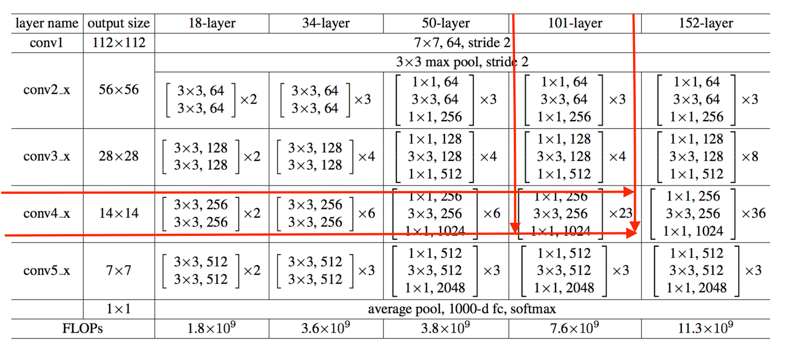
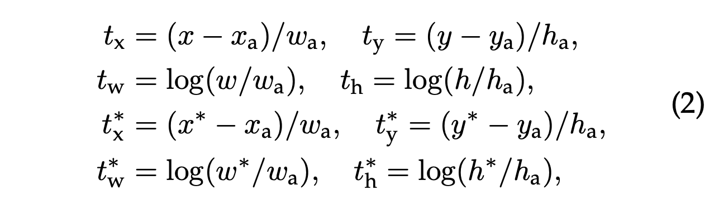

# Faster RCNN: Step by Step

## Overview

Faster R-CNN is an object detection model that performs detection in 2 stages. The first stage proposes regions likely to contain objects, while the second stage detects actual objects in the proposed regions. The first stage is often referred to as the region proposal stage and the second, the detection stage. Region proposal is made possible by the use of a region proposal network, RPN. This network takes as input an image and produces bounding boxes for possible object regions in the image. A detector network is responsible for classifying each proposed region into the object class it contains. Both the RPN and the detector network rely on a pre-trained backbone network for image feature extraction. 

This implementation attempts to present all the components of faster R-CNN in simple steps that can serve as a reference for anyone on a quest to understand this object detection model. It is implemented in tensorflow.

## Installation
To install, just clone the repository and install with pip as illustrated below

```bash
git clone https://github.com/ldfrancis/faster_rcnn.git
cd faster_rcnn
pip install .
```

NB: You might find it helpful to use a virtual environment
## Usage
This model can be used either as a cli application or as a python package in a project.

### cli application
To use as a cli application, use any of the following commands to perform the desired action
1. Detect objects in an image

    `fasterrcnn --input ./input.jpg --output ./output_folder`
    
    This commad detects object in an image with the file path './input.jpg' and saves the result in the folder './output_folder'. The result includes an image having the bounding boxes of the detected objects drawn and json file containing detected objects information in terms of the bounding boxes and object classes.

    Also, the path to a folder containing several images can be supplied. In this case, objects would be detected in the each image and results would be saved in the supplied output folder.

    `fasterrcnn --input ./input_folder --output ./output_folder`

    If no output folder is supplied, the results would be saved in './output'

2. Train faster r-cnn on a dataset

    `fasterrcnn --train --dataset voc`

    This trains the model on the pascal voc dataset. Training can only be done on pascal voc as this repo focuses on the implementation process.


### as a package
This can be used within a python project like so;
```python
from fasterrcnn import FRCNN
from fasterrcnn.utils import (
    frcnn_default_config,
    load_config,
)
from fasterrcnn.data_utils import save_results

cfg = load_config("./path_to_config.yaml")
frcnn_default_config.update(cfg)

frcnn = FRCNN(frcnn_default_config)
image_path = "./image.jpg"
bboxes, scores = frcnn(image_path)

result = save_results(bboxes, scores)
```

For Training

```python
from fasterrcnn import FRCNN, Trainer
from fasterrcnn.config_utils import (
    frcnn_default_config,
    trainer_default_config,
    load_config,
)
from fasterrcnn.data_utils import save_results, obtain_dataset


cfg = load_config("./path_to_config.yaml")
frcnn_default_config.update(cfg)
trainer_default_config.update(cfg.get("trainer",{}))

frcnn = FRCNN(frcnn_default_config)
trainer = Trainer(frcnn, trainer_default_config)

train_dataset, val_dataset = obtain_dataset("name of dataset or path to dataset folder")

trainer.train(train_dataset, val_dataset)
```

## Results
Checkpoints for the faster rcnn models from Detectron2 were used for initialization when training the model here. Below are the results obtained after initialization and finetuning on COCO and VOC.

## Step by Step Implementation
This section presents the steps to take in order to implement faster rcnn. The implementation involves designing 3 different models and several utility functions. This models are the backbone, RPN, and detector. 

To detect objects in an image first the image is normalized using a preprocessor after which it is passed into a feature extractor in the backbone. The extracted feature map is passed into the RPN which outputs bounding boxes for regions likely to contain objects. An operation called roi pooling is used to obtain regions on the feature map that correspond to the bounding boxes. This regions are then fed into the detector for object class prediction and bounding box refinement. 

### The backbone
The backbone is an image classification network pretrained on the image-net dataset. A pretrained ResNet 101 network can be used in this case and the feature map is obtained the output of the conv4 layer. 
The model from keras application has last layer in the conv4 block with a name 'conv4_block23_out'. 



The output from this layer is of size 14x14x1024. The backbone's feature extractor is built using the layers from ResNet 101 up to 'conv4_block23_out' a snippet is shown below and can be found in [here](fasterrcnn/backbone/extractor)
```python
class ResNet101Extractor(Extractor):
    def __init__(self, name: str = "ResNet101Extractor"):
        super(ResNet101Extractor, self).__init__(name=name)

    def build_architecture(self):
        resnet101_base = tf.keras.applications.ResNet101(
            input_shape=(None, None, 3), include_top=False
        )
        output_layer_name = "conv4_block23_out"
        self.inputs = [resnet101_base.input]
        self.outputs = [resnet101_base.get_layer(output_layer_name).output]
```

The backbone is further split into two parts, a head and a tail. The head part is responsible for preprocessing the input image and extracting a feature map for the RPN while the tail part is responsible for further processing features of proposed regions before passing them to the detector and is built using the conv5 layer of ResNet 101. The tail network's input comes from the layer 'conv4_block23_out' and it's output is the last layer in conv5. The tail network implementation can be found [here](fasterrcnn/backbone/tail_network). 

### The RPN
The RPN is responsible for proposing object regions in an image. It consisting of base convolutional network (this uses 512 3x3 filters) that takes in the feature map from the backbone. The output from this base convolution retains the input dimensions (width and height) and has 512 channels. This is then fed into two seperate convolutional layers. One convolution layer computes offsets for the bounding boxes with respect to a set of anchor boxes. This layer uses k*4 1x1 filters, where k is the number of anchor boxes. The other layer computes the objectness score. 
#### The anchors
The anchor boxes are usually defined using a reference/base size and some aspect ratios and scales. Given a base size of (256,256), 3 aspect ratios, and 3 scales, we get a total of 3x3=9 anchor boxes. This anchor boxes might not fit the ground truth bounding boxes perfectly so the RPN aims to predict offsets to this anchors such that when applied to the anchors would give rise to bounding boxes that are well aligned with the ground truth boxes. Anchor generation is implemented [here]()

#### encoded offsets/deltas
The bounding box predictions from the rpn are encoded offsets for the the anchor boxes. This encoding is done using the anchor boxes and their respective ground truth boxes, and they represent the offsets/deltas by which the anchor boxes should be adjsted to realise the respective ground truth boxes. The formulation of this encoding is given in equation 2 of the [fastr r-cnn paper](https://arxiv.org/pdf/1506.01497.pdf) as shown below



Here, x,y,w,h are the center cordinate and dimensions of the proposed boxes, x^*,y^*,w^*,h^* are for the ground truth boxes, while x_a, y_a, w_a, h_a are the center cordinate and dimensions of the anchor boxes. This is implemented in [this utility function]()

#### decoding the deltas
The RPN predicts tx, ty, tw,and th which are termed deltas and the actual bounding box centers and dimensions are decoded from this deltas by changing the subject of the formula containing tx, ty, tw,and th for x,y,w, and h. For example, x = w_a * t_x + x_a. This implementation can be found [here]()

#### Training the RPN
The RPN is trained by predicting the encoded deltas tx,ty,tw,th and comparing them to the actual deltas tx*, ty*,tw*,th* using the l1-smooth loss. The goal is to ensure that what is predicted is equal to actual deltas (referred to as the targets in this case) which were encoded using the ground truth boxes and the anchors.

Before proceeding to train the RPN, these targets are generated for the RPN. This is done for all anchor boxes and positive and negative boxes are identified in this process. positive achor boxes are the ones that can be effectively assigned a ground truth bounding box. This decision is made by using the intersection over union (iou) between an anchor and the ground truth boxes such that an iou greater than a threshold say 0.7 depicts that an anchor is positive while anchors having iou less than 0.3 with all ground truths are negative. This notion of positive and negative anchors are used to set the objectness score for training, 0 for negative and 1 for positive. This targets are generated in [this utilitly function, generate_rpn_targets]()

The RPN bounding box prediction is trained with the smooth l1 loss while the classification/ objectness score is trained using cross-entropy loss

### The Detector
The processed roi features from the backbone's tail network is passed into the detector network for bounding box prediction and object classification. The predictions made by the detector are encoded offsets/deltas for the regions proposed by the RPN. The encoding is done in the same manner as the anchors, replacing the anchors with the proposed bounding boxes. The detector architecture is found [here]()


### utility functions
Besides the models for the Backbone, RPN, and Detector, several utility functions are used to transform tensors when moving from one model to another. For example, to move from the RPN to the Detector, the proposed bounding boxes have to be filtered and an operation known as roi pooling has to be performed. Links to the implementation of each of these utility functions are provided below:

[to_center_width_height]() | 
[encode]() [decode]() | 
[bbox_overlap]() | 
[swap_xy]() | 
[generate_reference_anchors]() | 
[generate_anchors]() | 
[generate_rpn_targets]() | 
[normalize_bboxes]() | 
[roi_pooling]() | 
[filter_proposals]() |  
[apply_nms]() | 
[per_class_nms]() |  
[generate_detector_targets]() 


**NB: This repository is entirely focused on the implementation of faster rcnn. To further understand the working principle of Faster RCNN, consider studying the [original paper]() and also checkout [this blog post by tryolabs](). [This workshop exercise]() by tryolabs is also helpful**


